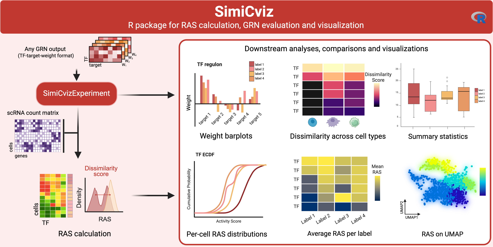

# SimiCviz

SimiCviz — Visualization tools for SimiC and SimiCPipeline outputs.

A lightweight R/Bioconductor-oriented package to import, summarize, and visualize
single-cell gene regulatory network (GRN) outputs (weights, TF activity/AUC,
network summaries, and dissimilarity metrics) from
[SimiCPipeline](https://github.com/ML4BM-Lab/SimiCPipeline) and other GRN
inference tools (SCENIC, Pando, etc.).

## Graphical abstract



## Installation

Install from GitHub:
```r
if (!requireNamespace("remotes", quietly = TRUE)) install.packages("remotes")
remotes::install_github("ML4BM-Lab/SimiCviz")
```

Python-backed import helpers rely on `reticulate`. At runtime, the package
calls `reticulate::py_require()` to request Python >= 3.8 together with the
`numpy`, `pandas`, and `anndata` packages. If those packages are not already
available, `reticulate` can resolve them in a managed Python environment.

When available on Bioconductor:
```r
if (!requireNamespace("BiocManager", quietly = TRUE)) install.packages("BiocManager")
BiocManager::install("SimiCviz")
```

## Quick start
### From a SimiCPipeline run

`load_SimiCPipeline` automatically locates all output files given the project
directory, run name, and regularization hyperparameters:

```r
library(SimiCviz)

simic <- load_SimiCPipeline(
  project_dir = "path/to/simic_run",
  run_name    = "example1",
  lambda1     = "0.01",
  lambda2     = "0.001"
)

# Set display names and colors for visualization
simic <- setLabelNames(
  simic,
  label_names = c("control", "treated"),
  colors      = c("#e0e0e0", "#c1a9e0")
)
```

If you ran the full [SimiCPipeline tutorial](https://github.com/ML4BM-Lab/SimiCPipeline/blob/master/notebooks/Tutorial_SimiCPipeline_full.ipynb) you can skip activity score computation and go straight to visualization.

Expected SimiCPipeline directory layout:
```
Project/
├── inputFiles/
│   ├── TF_list.csv
│   ├── expression_matrix.pickle
│   └── phenotype_annotation.txt
└── outputSimic/
    └── matrices/
        └── example1/
            ├── example1_L1_0.01_L2_0.001_simic_matrices.pickle
            ├── example1_L1_0.01_L2_0.001_simic_matrices_filtered_BIC.pickle
            ├── example1_L1_0.01_L2_0.001_wAUC_matrices_filtered_BIC.pickle
            └── example1_L1_0.01_L2_0.001_wAUC_matrices_filtered_BIC_collected.csv
```

### Bundled example data

The examples shipped with the package are a reduced subset derived from the
[SimiC-Suite case study](https://ml4bm-lab.github.io/ML4BM-Lab/software/SimiC-Suite/src/case-study.html).
They include representative SimiCPipeline outputs for the NBM, SMM, and
MM disease-stage labels, reduced to keep the Bioconductor vignette and
examples lightweight.

The fastest way to start is to load the pre-built `SimiCvizExperiment` object:

```r
library(SimiCviz)

simic <- readRDS(system.file("extdata", "simic_full.rds",
                             package = "SimiCviz"))
simic
```

This object already contains GRN weights, collected TF activity/AUC scores,
cell labels, display names, colors, and adjusted R² values.

### Load the shipped files manually

You can also rebuild an object from the example CSV files:

```r
weight_path <- system.file("extdata", "example_weights.csv",
                           package = "SimiCviz")
auc_path <- system.file("extdata", "example_auc.csv",
                        package = "SimiCviz")
cell_labels_path <- system.file("extdata",
                                file.path("inputFiles",
                                          "disease_stage_annotation.csv"),
                                package = "SimiCviz")

simic_csv <- load_from_csv(
  weights_file     = weight_path,
  auc_file         = auc_path,
  cell_labels_file = cell_labels_path,
  meta             = list(run_name = "bioc_example")
)
```

Or load individual inputs when you need more control:

```r
weights_df <- read_weights_csv(weight_path)
cell_labels <- load_cell_labels(cell_labels_path, header = TRUE, sep = ",")

expression_mat_path <- system.file("extdata",
                                   file.path("inputFiles",
                                             "example_expression.pickle"),
                                   package = "SimiCviz")

# Only needed when computing activity scores from expression + weights.
processor <- AUCProcessor(
  weights     = weights_df,
  expression  = expression_mat_path,
  cell_labels = cell_labels,
  n_cores     = 2,
  backend     = "multicore"
)
processor <- compute_auc(processor, sort_by = "expression", verbose = TRUE)
auc_wide <- get_auc(processor, format = "wide")
```

For direct SimiCPipeline pickle outputs, the package also ships:

```r
weights_file <- system.file("extdata",
                            file.path("outputSimic",
                                      "example_simic_weights.pickle"),
                            package = "SimiCviz")
simic_weights <- read_weights_pickle(weights_file)

auc_collected <- load_collected_auc(system.file(
  "extdata",
  file.path("outputSimic", "example_simic_auc_collected.csv"),
  package = "SimiCviz"
))
```

Note: `read_pickle()`, `read_weights_pickle()`, `read_auc_pickle()`, and H5AD
import paths use `reticulate` and therefore depend on a Python environment
that satisfies the runtime request above.

## Plot examples

```r
# Model fit diagnostics — SimiC only
plot_r2_distribution(simic@meta$adjusted_r_squared, simic, grid = c(2, 2))

# Dissimilarity scores — ranks TFs by regulatory divergence across conditions
dis_score <- calculate_dissimilarity(simic, verbose = FALSE)
top_tfs   <- rownames(dis_score)

# Weight barplots (top targets per TF)
plot_tf_weights(simic, tf_names = top_tfs[1:4], top_n = 25, grid = c(2, 2))

# Regulators of each target gene
plot_target_weights(simic, target_names = simic@target_ids[1:4], grid = c(2, 2))

# Regulatory network heatmap for a single TF
plot_tf_network_heatmap(simic, top_tfs[1], top_n = 15, r2_threshold = 0.7)

# Dissimilarity heatmap (top divergent TFs)
plot_dissimilarity_heatmap(simic, top_n = 10, cmap = "viridis")

# Cell-type-specific dissimilarity (subset by cluster/annotation)
metadata <- read.csv(system.file("extdata", "metadata.csv",
                                 package = "SimiCviz"))
cell_groups <- lapply(unique(metadata$cluster), function(cluster) {
  metadata$Cell[metadata$cluster == cluster]
})
names(cell_groups) <- unique(metadata$cluster)
plot_dissimilarity_heatmap(simic, cell_groups = cell_groups, top_n = 5, cmap = "magma")

# Activity score density distributions
plot_auc_distributions(simic, tf_names = top_tfs[1:4],
                       fill = TRUE, alpha = 0.6, bw_adjust = 1/8,
                       rug = TRUE, grid = c(2, 2))

# Cumulative distributions (ECDF) with AUC comparison table
plot_auc_cumulative(simic, tf_names = top_tfs[1:4],
                    rug = TRUE, grid = c(2, 2), include_table = TRUE)

# ECDF-based comparison metrics
ecdf_metrics <- calculate_ecdf_auc(simic, tf_names = simic@tf_ids[1:4])

# Summary heatmap (mean activity per TF × condition)
plot_auc_heatmap(simic, top_n = 20)

# Box / violin summary statistics
plot_auc_summary_statistics(simic)
```

## Main features
- Load and standardize GRN outputs from SimiCPipeline and generic CSV/H5AD/pickle/RDS formats.
- Build and manage `SimiCvizExperiment` containers for weights, AUC/activity, cell labels, and metadata.
- Compute activity scores from expression + GRN weights using `calculate_activity_scores` or `AUCProcessor`.
- Flexible quality filtering by R², p-value, or any custom metric column.
- Perform TF-level dissimilarity analysis across labels and optional cell groups.
- Compute ECDF-based comparison metrics with `calculate_ecdf_auc`.
- Import/export tabular results for reproducible analysis workflows.

## Plotting functions
- Weight visualization: `plot_tf_weights`, `plot_target_weights`
- Network view: `plot_tf_network_heatmap`
- Model fit diagnostics (SimiC): `plot_r2_distribution`
- Dissimilarity: `plot_dissimilarity_heatmap`
- Activity distributions: `plot_auc_distributions`, `plot_auc_cumulative`
- Summary views: `plot_auc_heatmap`, `plot_auc_summary_statistics`

## Documentation
Full worked examples are in the package vignette. After installing, open it with:
```r
browseVignettes("SimiCviz")
```
## Contributing
Contributions, issues and feature requests are welcome. Please open issues or pull requests on the GitHub repository.

## Contact
Irene Marín-Goñi — imarin.4@alumni.unav.es

## License
MIT
